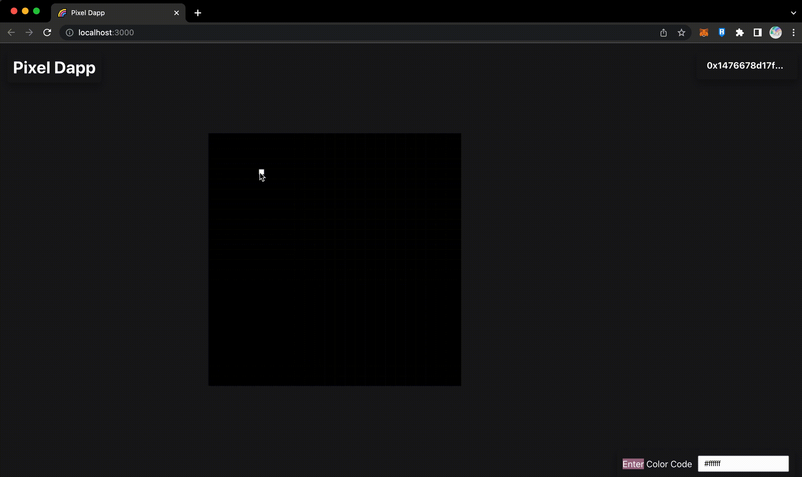

# Pixel Dapp

Web3 version of pxls.space on ethereum blockchain. 

After pxls.space has been launch, I have an idea to improve this website by put it in the blockchain.
This is a multiplayer online collaborative canvas that allows you to create anything you can imagine, one pixel at the time, only if you have ethereum in your pocket.
Every pixels that painted on canvas will be saved on the ethereum block chain.

## Demo
The demo will be powered on Rinkeby Test Network so you can come and try it for free!

🔗 [Smart Contract](https://rinkeby.etherscan.io/address/0x2210b8647cFD764d0d9206B3292790768802c708)

🕸 [Demo](https://61130061.github.io/PixelDapp/)

### Quick Start
1. Connect your metamask with Pixel Dapp.
2. Enter hex color code at the right bottom.
3. Double click on the canvas to put your color on the blockchain.

## Future
This project could be placed on NFT market by minting the canvas on the chain and sell it as NFT.
The profit of NFT will be split to everyone who painted on the canvas.
When this project is finished, it might be place on the main ethereum chain.

### TODO List
- [ ] Build mint function (sell canvas as NFT and reset the canvas)
- [ ] Add favorit colors
- [ ] Guild modal
- [ ] Realtime activity (eg. 0x14524453... painted (0, 0) with '#ffffff' color)
- [ ] Bigger canvas size (Right now 50x50 pixels)

## Contributing
I'm a newbiew web3 developer so feel free to pull requiests or log issues.

Help me make it possible.

